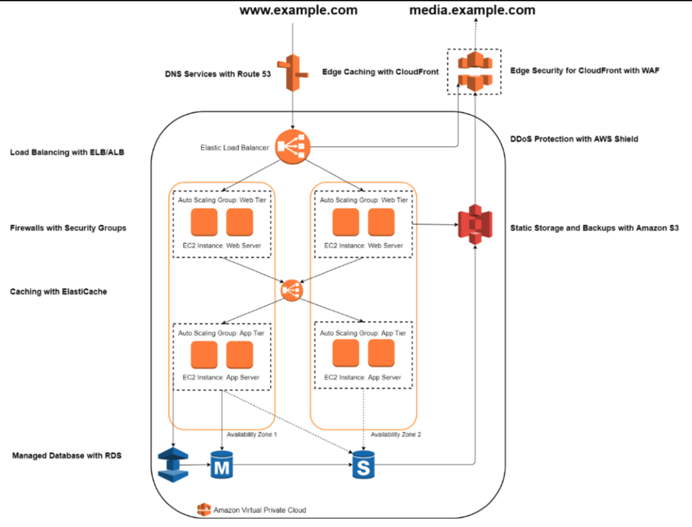

**Workshop 003 (comming soon...)** - AWS Security fundamentals, logging, monitoring and incident reponse.

Link to [AWS Products page](https://aws.amazon.com/products/)

---

## Useful links

* ...links to be shared

---

## Confirm your Region

* Region **US East (N. Virginia)** `us-east-1`

---

## Enable GuardDuty

Services --> `GuardDuty`

* Enable GuardDuty

---

## Create AWS Systems Manager role to access the webserver

Services --> `IAM`

* Roles
  * Create role, AWS service, `EC2`
  * Attach permissions policies: `AmazonEC2RoleforSSM`
  * Add tags: `Name` - `ROLE-AmazonEC2RoleforSSM`
  * Role name: `ROLE-AmazonEC2RoleforSSM`

---

## Name the Default VPC

Services --> `VPC`

* Default name `Default-VPC`on existent VPC

---

## Launch first webserver with Public IP

Services --> `EC2` --> `Launch Instance`

* 1 - Choose AMI - `Amazon Linux 2 AMI (HVM), SSD Volume Type`

* 2 - Choose Instance Type - `t2.micro, Free tier eligible`

* 3 - Configure Instance
  * IAM role: `ROLE-AmazonEC2RoleforSSM`
  * **Advanced Details**, `User data`:

```bash
#!/bin/bash
yum  update -y

curl https://gist.githubusercontent.com/AntonioFeijaoUK/d8533a71e5ecff2971f6859a7be426da/raw/3d0930004b937f6dd7f273021218327b7129d609/aws-ec2-userdata-landing-webpage.sh | bash

# end script
```

* 4 - Add Storage
  * Click `Next`

* 5 - Add Tags
  * `Name` - `webserver-001-default-vpc`

* 6 - Configure Security Group
  * Create a new security group
  * Name and Description: `http-world`
  * Type: `HTTP`, Protocol: `TCP`, Port Range: `80`, Source Custom: `0.0.0.0/0`, Description

* 7 - Review
  * Launch instance without key par - `Proceed without a key pair`, acknowledge and click `Launch Instances`

---

## Connect to the instance with AWS Systems Manager

Services --> `AWS Systems Manager`

* Managed Instances, select your instance, `Actions`, `Start Session`

Sample suggestive test commands

```bash
sudo su

curl ipinfo.io

## check the instance public IP and open a browser on that ip

cd /var/log/httpd/

## check the files `access_log` and `error_log`

cat access_log

cat error_log

## ...

```

---

## Part 1 workshop review

* Enabled [Amazon GuardDuty](https://aws.amazon.com/guardduty/) to alert on security [findings](https://docs.aws.amazon.com/guardduty/latest/ug/guardduty_finding-types-active.html).

* Created a service role to access an instance without using key par

* Named the Default VPC - *more about* [VPC Security](https://docs.aws.amazon.com/vpc/latest/userguide/security.html)

* Created instance with a script in the `user data` field to install a web service service at launch

* The web service instance only protection is the `inbound` [Security Group](https://docs.aws.amazon.com/vpc/latest/userguide/VPC_SecurityGroups.html) with `http to the world`, which allow ports 80 from anywhere `0.0.0.0/0`

Currently this instance is exposed to the world (`0.0.0.0/0`), we will start adding protection and apply best pratices.

Next we will look at:

* [Amazon EC2](https://aws.amazon.com/ec2/) - *Secure and resizable compute capacity in the cloud. Launch applications when needed without upfront commitments.*

* [Amazon EC2 Auto Scaling](https://aws.amazon.com/ec2/autoscaling/) - *Add or remove compute capacity to meet changes in demand
*

* [Amazon Inspector](https://aws.amazon.com/inspector/) - *Automated security assessment service to help improve the security and compliance of applications deployed on AWS*

* [Amazon CloudWatch](https://aws.amazon.com/cloudwatch/) - *Observability of your AWS resources and applications on AWS and on-premises

* [AWS Auto Scaling](https://aws.amazon.com/autoscaling/) - *Application scaling to optimize performance and costs*

* [AWS CloudTrail](https://aws.amazon.com/cloudtrail/) - *Track user activity and API usage*

* [AWS Config](https://aws.amazon.com/config/) - *Record and evaluate configurations of your AWS resources*

* [AWS Well-Architected Tool](https://aws.amazon.com/well-architected-tool/) - *Review your architecture and adopt best practices*

* [AWS Trusted Advisor](https://aws.amazon.com/premiumsupport/technology/trusted-advisor/) - *Reduce costs, increase performance, and improve security*

---

## Create multi-layer security and high available web servers

Lets create a web architected, secure and high available web application

Sample diagram 


## Install another instance with Ubuntu

- 


* 


---

## Links to resources

<https://aws.amazon.com/blogs/publicsector/how-to-think-about-zero-trust-architectures-on-aws/>

<https://github.com/aws-samples/aws-refarch-wordpress>


---

## Done by

* Linkedin - [AntonioFeijaoUK](https://www.linkedin.com/in/antoniofeijaouk/)
* Twitter - [@AntonioFeijaoUK](https://twitter.com/AntonioFeijaoUK)
* Personal Webpage - [AntonioCloud.Com](https://www.antoniocloud.com)

---

## The End


---

## Thank you
